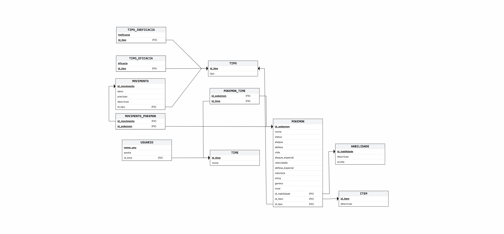

# Identificação da Dupla e Modelo de Dados

## Identificação da Dupla

**Integrante 1:** Elton Bruno dos Santos Lima
**Matrícula:** 20251014040011 

**Integrante 2:** Henze Fernandes Pinto
**Matrícula:** 20251014040008

---

# Modelo de Dados

## Diagrama Relacional

O diagrama relacional do sistema está disponível na pasta de imagens do projeto.

**Link da pasta de imagens:**

---

## Dicionário de Dados

## 3. Dicionário de Dados

--- 
**Tabela** : USUARIO

*Descrição* : Armazena os dados dos jogadores cadastrados no Pokémon Showdown

*Observações* : -

| Colunas | Descrição | Tipo de Dado | Tamanho | Null | PK | FK | Unique | Identity | Default | Check | 
| ------- | --------- | ------------ | ------- | ---- | -- | -- | ------ | -------- | ------- | ----- |
| nome_usu | Nome de usuário único do jogador | VARCHAR | 50 | &#9744; | &#9745; | &#9744; | &#9745; | &#9744; | - | - |
| senha | Senha de acesso do usuário | VARCHAR | 255 | &#9744; | &#9744; | &#9744; | &#9744; | &#9744; | - | - |

--- 
**Tabela** : TIME

*Descrição* : Armazena os times criados pelos usuários para batalhas

*Observações* : -

| Colunas | Descrição | Tipo de Dado | Tamanho | Null | PK | FK | Unique | Identity | Default | Check | 
| ------- | --------- | ------------ | ------- | ---- | -- | -- | ------ | -------- | ------- | ----- |
| id_time | Identificador único do time | INTEGER | - | &#9744; | &#9745; | &#9744; | &#9744; | &#9745; | - | - |
| nome | Nome do time | VARCHAR | 100 | &#9744; | &#9744; | &#9744; | &#9744; | &#9744; | - | - |
| nome_usu | Chave estrangeira referenciando USUARIO | VARCHAR | 50 | &#9744; | &#9744; | &#9745; | &#9744; | &#9744; | - | - |

--- 
**Tabela** : POKEMON

*Descrição* : Armazena os dados dos Pokémons utilizados nos times

*Observações* : -

| Colunas | Descrição | Tipo de Dado | Tamanho | Null | PK | FK | Unique | Identity | Default | Check | 
| ------- | --------- | ------------ | ------- | ---- | -- | -- | ------ | -------- | ------- | ----- |
| id_pokemon | Identificador único do Pokémon | INTEGER | - | &#9744; | &#9745; | &#9744; | &#9744; | &#9745; | - | - |
| nome | Nome do Pokémon | VARCHAR | 100 | &#9744; | &#9744; | &#9744; | &#9744; | &#9744; | - | - |
| nivel | Nível do Pokémon (1 a 100) | INTEGER | - | &#9744; | &#9744; | &#9744; | &#9744; | &#9744; | - | nivel BETWEEN 1 AND 100 |
| genero | Gênero do Pokémon | VARCHAR | 10 | &#9745; | &#9744; | &#9744; | &#9744; | &#9744; | - | - |
| shiny | Indica se o Pokémon é shiny | BOOLEAN | - | &#9744; | &#9744; | &#9744; | &#9744; | &#9744; | False | - |
| vida | Pontos de vida do Pokémon | INTEGER | - | &#9744; | &#9744; | &#9744; | &#9744; | &#9744; | - | - |
| ataque | Estatística de ataque físico | INTEGER | - | &#9744; | &#9744; | &#9744; | &#9744; | &#9744; | - | - |
| defesa | Pontos de defesa | INTEGER | - | &#9744; | &#9744; | &#9744; | &#9744; | &#9744; | - | - |
| ataque_especial | Estatística de ataque especial | INTEGER | - | &#9744; | &#9744; | &#9744; | &#9744; | &#9744; | - | - |
| defesa_especial | Estatística de defesa especial | INTEGER | - | &#9744; | &#9744; | &#9744; | &#9744; | &#9744; | - | - |
| velocidade | Estatística de velocidade | INTEGER | - | &#9744; | &#9744; | &#9744; | &#9744; | &#9744; | - | - |
| natureza | Natureza do Pokémon que afeta | VARCHAR | 20 | &#9744; | &#9744; | &#9744; | &#9744; | &#9744; | - | - |
| status | Status especial do Pokémon | VARCHAR | 30 | &#9745; | &#9744; | &#9744; | &#9744; | &#9744; | - | - |
| id_habilidade | Chave estrangeira referenciando HABILIDADE | INTEGER | - | &#9745; | &#9744; | &#9745; | &#9744; | &#9744; | - | - |
| id_item | Chave estrangeira referenciando ITEM | INTEGER | - | &#9745; | &#9744; | &#9745; | &#9744; | &#9744; | - | - |
| id_tipo | Chave estrangeira referenciando TIPO | INTEGER | - | &#9744; | &#9744; | &#9745; | &#9744; | &#9744; | - | - |

--- 
**Tabela** : MOVIMENTO

*Descrição* : Armazena os movimentos disponíveis no jogo

*Observações* : -

| Colunas | Descrição | Tipo de Dado | Tamanho | Null | PK | FK | Unique | Identity | Default | Check | 
| ------- | --------- | ------------ | ------- | ---- | -- | -- | ------ | -------- | ------- | ----- |
| id_movimento | Identificador único do movimento | INTEGER | - | &#9744; | &#9745; | &#9744; | &#9744; | &#9745; | - | - |
| dano | Dano base do movimento | INTEGER | - | &#9745; | &#9744; | &#9744; | &#9744; | &#9744; | - | - |
| precisao | Precisão do movimento em porcentagem | INTEGER | - | &#9745; | &#9744; | &#9744; | &#9744; | &#9744; | - | precisao BETWEEN 1 AND 100 |
| descricao | Descrição do efeito do movimento | TEXT | - | &#9744; | &#9744; | &#9744; | &#9744; | &#9744; | - | - |
| id_tipo | Chave estrangeira referenciando TIPO | INTEGER | - | &#9744; | &#9744; | &#9745; | &#9744; | &#9744; | - | - |

--- 
**Tabela** : TIPO

*Descrição* : Armazena os tipos elementais do jogo

*Observações* : -

| Colunas | Descrição | Tipo de Dado | Tamanho | Null | PK | FK | Unique | Identity | Default | Check | 
| ------- | --------- | ------------ | ------- | ---- | -- | -- | ------ | -------- | ------- | ----- |
| id_tipo | Identificador único do tipo | INTEGER | - | &#9744; | &#9745; | &#9744; | &#9744; | &#9745; | - | - |
| tipo | Nome do tipo (ex: Fogo, Água, Planta) | VARCHAR | 20 | &#9744; | &#9744; | &#9744; | &#9745; | &#9744; | - | - |

--- 
**Tabela** : HABILIDADE

*Descrição* : Armazena as habilidades passivas dos Pokémons

*Observações* : -

| Colunas | Descrição | Tipo de Dado | Tamanho | Null | PK | FK | Unique | Identity | Default | Check | 
| ------- | --------- | ------------ | ------- | ---- | -- | -- | ------ | -------- | ------- | ----- |
| id_habilidade | Identificador único da habilidade | INTEGER | - | &#9744; | &#9745; | &#9744; | &#9744; | &#9745; | - | - |
| descricao | Descrição do efeito da habilidade | TEXT | - | &#9744; | &#9744; | &#9744; | &#9744; | &#9744; | - | - |
| oculta | Indica se a habilidade é uma habilidade oculta | BOOLEAN | - | &#9744; | &#9744; | &#9744; | &#9744; | &#9744; | - | - |

--- 
**Tabela** : ITEM

*Descrição* : Armazena os itens que podem ser equipados aos Pokémons

*Observações* : -

| Colunas | Descrição | Tipo de Dado | Tamanho | Null | PK | FK | Unique | Identity | Default | Check | 
| ------- | --------- | ------------ | ------- | ---- | -- | -- | ------ | -------- | ------- | ----- |
| id_item | Identificador único do item | INTEGER | - | &#9744; | &#9745; | &#9744; | &#9744; | &#9745; | - | - |
| descricao | Descrição do efeito do item | TEXT | - | &#9744; | &#9744; | &#9744; | &#9744; | &#9744; | - | - |

--- 
**Tabela** : TIPO_EFICACIA

*Descrição* : Armazena os tipos contra os quais um tipo causa dano aumentado

*Observações* : -

| Colunas | Descrição | Tipo de Dado | Tamanho | Null | PK | FK | Unique | Identity | Default | Check | 
| ------- | --------- | ------------ | ------- | ---- | -- | -- | ------ | -------- | ------- | ----- |
| id_tipo | Chave estrangeira referenciando TIPO | INTEGER | - | &#9744; | &#9745; | &#9745; | &#9744; | &#9744; | - | - |
| eficacia | Nome do tipo que sofre dano aumentado | VARCHAR | 20 | &#9744; | &#9745; | &#9744; | &#9744; | &#9744; | - | - |

--- 
**Tabela** : TIPO_INEFICACIA

*Descrição* : Armazena os tipos contra os quais um tipo causa dano reduzido

*Observações* : -

| Colunas | Descrição | Tipo de Dado | Tamanho | Null | PK | FK | Unique | Identity | Default | Check | 
| ------- | --------- | ------------ | ------- | ---- | -- | -- | ------ | -------- | ------- | ----- |
| id_tipo | Chave estrangeira referenciando TIPO | INTEGER | - | &#9744; | &#9745; | &#9745; | &#9744; | &#9744; | - | - |
| ineficacia | Nome do tipo que sofre dano reduzido | VARCHAR | 20 | &#9744; | &#9745; | &#9744; | &#9744; | &#9744; | - | - |

--- 
**Tabela** : MOVIMENTO_POKEMON

*Descrição* : Tabela associativa que representa os movimentos aprendidos por cada Pokémon

*Observações* : Chave primária composta por id_movimento e id_pokemon

| Colunas | Descrição | Tipo de Dado | Tamanho | Null | PK | FK | Unique | Identity | Default | Check | 
| ------- | --------- | ------------ | ------- | ---- | -- | -- | ------ | -------- | ------- | ----- |
| id_movimento | Chave estrangeira referenciando o movimento | INTEGER | - | &#9744; | &#9745; | &#9745; | &#9744; | &#9744; | - | - |
| id_pokemon | Chave estrangeira referenciando o Pokémon | INTEGER | - | &#9744; | &#9745; | &#9745; | &#9744; | &#9744; | - | - |

--- 
**Tabela** : POKEMON_TIME

*Descrição* : Tabela associativa que representa a composição dos times

*Observações* : Chave primária composta por id_pokemon e id_time

| Colunas | Descrição | Tipo de Dado | Tamanho | Null | PK | FK | Unique | Identity | Default | Check | 
| ------- | --------- | ------------ | ------- | ---- | -- | -- | ------ | -------- | ------- | ----- |
| id_pokemon | Chave estrangeira referenciando o Pokémon | INTEGER | - | &#9744; | &#9745; | &#9745; | &#9744; | &#9744; | - | - |
| id_time | Chave estrangeira referenciando o time | INTEGER | - | &#9744; | &#9745; | &#9745; | &#9744; | &#9744; | - | - |
